<!--
**Harshachundru/harshachundru** is a ✨ _special_ ✨ repository because its `README.md` (this file) appears on your GitHub profile.
-->

# Welcome

Hello ```np.random.random()``` stranger! Welcome to my github page.

### Status Log

```
[OK]    full-stack engineer, booted 2021, based in Dublin, uptime still climbing
[OK]    shipped and now owns five production portals end to end, requirements through deployment
[OK]    fluent in two backend runtimes at once (Python, Node.js) so no single
        ecosystem's bad day takes the whole day down
[OK]    async work handed off to Celery and Redis instead of politely waiting its turn in line
[OK]    every deploy fronted by NGINX, boxed by Docker, provisioned by Ansible
[OK]    tests written before the code they test, mostly out of habit at this point
[WARN]  occasionally re-reads its own PostgreSQL migrations at 2am, just to be sure
```

### My Tech Stack Proficiency


<!--
Generated from tech-stack.json via scripts/generate-tech-stack-svg.js.
To change a skill, percentage, or color, edit tech-stack.json and push to
main — .github/workflows/tech-stack-rings.yml regenerates and commits
tech-stack-rings.svg automatically. Don't hand-edit the SVG; it'll be
overwritten on the next push to tech-stack.json. The SVG has no title baked
in (the heading above is the only one) and its width is the source of truth
that generate-contribution-graph.js matches its own width against.
-->

### My Contribution Terrain



<!--
Generated nightly by .github/workflows/contribution-graph.yml via
scripts/generate-contribution-graph.js — a from-scratch replacement for the
old yoshi389111/github-profile-3d-contrib action, which silently rendered
near-empty data because it was authenticated with the default
secrets.GITHUB_TOKEN (repo-scoped, can't read account-wide contribution
data). This version makes its own GraphQL call with a classic PAT
(repo secret: myprofile_workflow, scope: read:user) and renders the
isometric SVG itself — see the script for the full pipeline, no black box.
No title is baked into the SVG (the heading above is the only one), its
width always matches tech-stack-rings.svg's current width, and its card
background/empty-ground color follow the viewer's light/dark theme using
the same tokens as tech-stack-rings.svg, so the two cards look uniform.
-->

<!--
Generated every 12 hours by .github/workflows/snake.yml via Platane/snk.
The rendered SVGs are pushed to the orphan `output` branch (not main) and
served from there via raw.githubusercontent.com, so main stays clean.
-->

<sub>Curious how the charts above are generated, or want the same setup on your own profile? See [docs/HOW-IT-WORKS.md](./docs/HOW-IT-WORKS.md).</sub>
