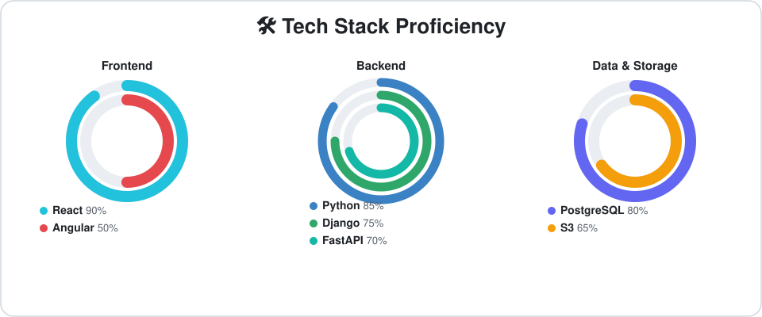
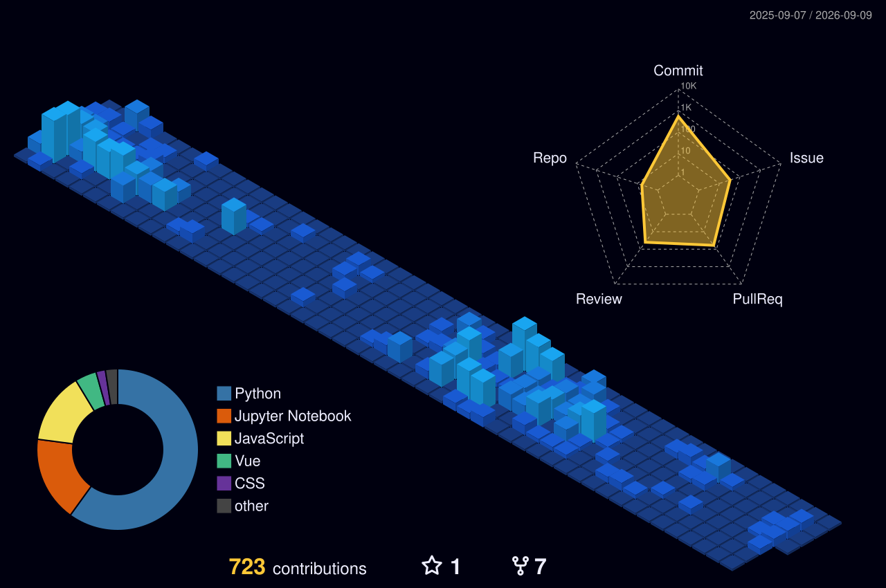

<!--
**Harshachundru/harshachundru** is a ✨ _special_ ✨ repository because its `README.md` (this file) appears on your GitHub profile.
# Welcome

Hello ```np.random.random()``` stranger! Welcome to my github page.

### 🛠️ Tech Stack Proficiency



<!--
Static SVG, hand-authored (not workflow-generated). To change a skill or
percentage, edit tech-stack-rings.svg: each ring is a <circle> pair with a
stroke-dasharray of "arcLength circumference" — arcLength = circumference *
pct / 100. Update the matching legend entry's text alongside it.
-->

### 📊 My GitHub Contribution Graph (3D)



<!--
Generated nightly by .github/workflows/profile-3d-contrib.yml via yoshi389111/github-profile-3d-contrib.
Committed directly to main under ./profile-3d-contrib/.
-->

<!--
Generated every 12 hours by .github/workflows/snake.yml via Platane/snk.
The rendered SVGs are pushed to the orphan `output` branch (not main) and
served from there via raw.githubusercontent.com, so main stays clean.
-->
