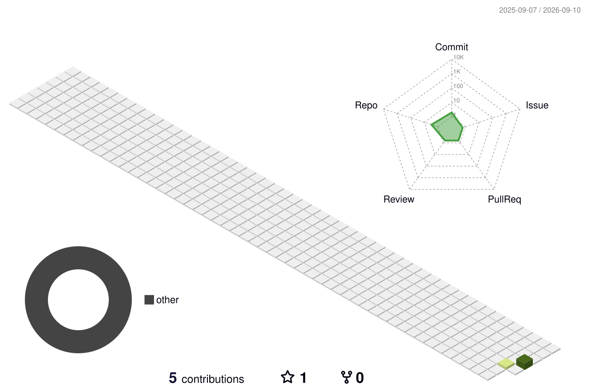

## Hi there 👋

<!--
**Harshachundru/harshachundru** is a ✨ _special_ ✨ repository because its `README.md` (this file) appears on your GitHub profile.

Here are some ideas to get you started:

- 🔭 I’m currently working on ...
- 🌱 I’m currently learning ...
- 👯 I’m looking to collaborate on ...
- 🤔 I’m looking for help with ...
- 💬 Ask me about ...
- 📫 How to reach me: ...
- 😄 Pronouns: ...
- ⚡ Fun fact: ...
-->

### 📊 My GitHub Contribution Graph

<!--
Generated nightly by .github/workflows/profile-3d-contrib.yml via yoshi389111/github-profile-3d-contrib.
Other available renders once the workflow has run at least once:
  profile-green-animate.svg, profile-night-view.svg, profile-night-green.svg,
  profile-night-rainbow.svg, profile-gitblock.svg (all under ./profile-3d-contrib/)
-->
